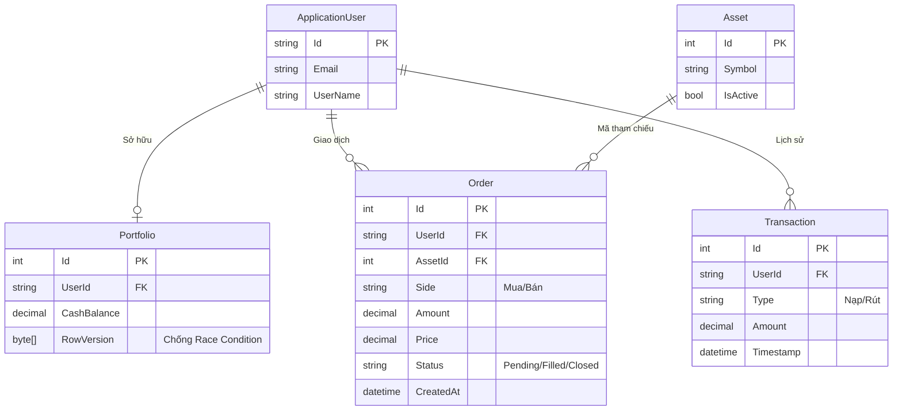
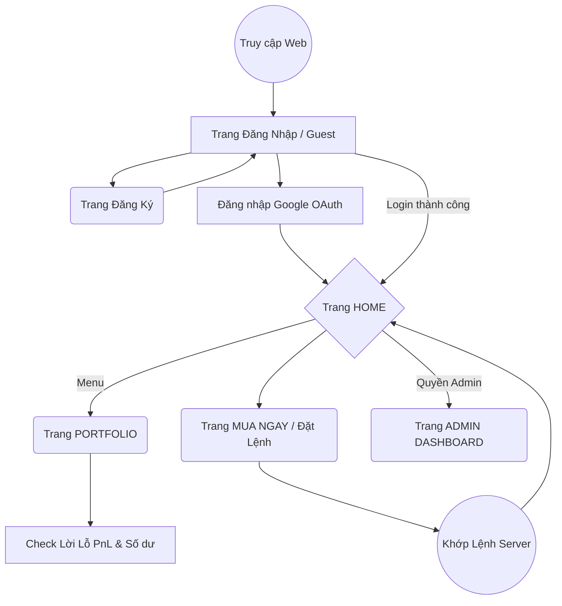
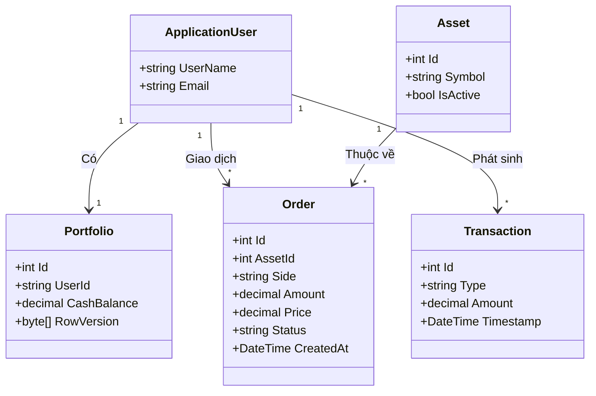

# BÁO CÁO MÔN HỌC
**Đề tài: Nền tảng Giao dịch Tài chính (Financial Platform)**

---

## 1. MÔ TẢ YÊU CẦU CHỨC NĂNG
Hệ thống **Financial Platform** mô phỏng một sàn giao dịch tài chính (tiền điện tử, cổ phiếu) theo thời gian thực. Các yêu cầu chức năng cốt lõi bao gồm:
- **Quản lý Tài khoản & Phân quyền:** Đăng ký, đăng nhập qua Email/Mật khẩu hoặc Google OAuth. Phân chia rõ quyền Người dùng thường (Trader) và Quản trị viên (Admin).
- **Ví đầu tư (Portfolio):** Tự động cấp vốn ảo ban đầu. Theo dõi Tiền mặt hiện có, Vị thế đang mở, Lãi/Lỗ (PnL) biến động theo từng giây của thị trường.
- **Bảng điện tử (Live Market):** Tích hợp biểu đồ nến TradingView cập nhật giá trực tiếp qua công nghệ WebSockets (SignalR) mà không cần làm mới trang. Gợi ý chỉ báo quá mua/quá bán (RSI).
- **Hệ thống Khớp Lệnh (Trading Engine):** Đặt lệnh Mua (Long) và Bán (Short). Tính toán khớp giá tự động với thị trường và trừ/cộng tiền tương ứng trong ví.
- **Trang Quản trị (Admin Dashboard):** Bảng điều khiển riêng dành cho Giám đốc/Admin xem thổng thể Khối lượng giao dịch của toàn sàn, số liệu người dùng, biểu đồ lệnh thông qua truy vấn CQRS-lite tốc độ cao.

---

## 2. SƠ ĐỒ CƠ SỞ DỮ LIỆU
Sơ đồ quan hệ thực thể (ERD) thể hiện sự kết nối giữa các bảng trong cơ sở dữ liệu `FinancialPlatformDb` (Microsoft SQL Server):

---

## 3. MÀN HÌNH GIAO DIỆN

### 3.1 Sơ đồ liên kết các trang giao diện

### 3.2 Trang HOME
- **Chức năng:** Là tấm bảng điều khiển trung tâm (Dashboard).
- **Giao diện:** Thiết kế Dark Theme + Glassmorphism. Ở giữa là biểu đồ nến Nhật bản khổng lồ (TradingView) nhấp nháy giá xanh/đỏ liên tục. Cột bên tay trái là Menu, cột bên tay phải là danh sách lịch sử lệnh và chỉ báo AI (RSI). Phía trên cùng có Dropdown để chuyển đổi giữa các mã tài sản như BTC, ETH.
- **Công nghệ nổi bật:** Nhận Push data từ SignalR để tự Update phần tử HTML không cần load lại trang.

### 3.3 Trang PORTFOLIO (Thay cho Trang Chi Tiết Sản Phẩm)
- **Chức năng:** Quản lý toàn bộ danh mục tài sản phi tập trung của User.
- **Giao diện:** Bố cục chia 2 phần. Phần trên là 3 tấm thẻ thống kê (Số dư tiền mặt, Lãi/Lỗ Ước tính, Tổng tài sản). Phần dưới là một Bảng (Table) thống kê các Vị thế đang mở, bao gồm Cặp tiền, Số lượng, Giá vào lệnh và Cột PnL liên tục nhảy số.
- **Bảo mật:** Dữ liệu sử dụng `RowVersion` mảng Byte dưới CSDL để chặn tình huống User bấm F5 mở 2 tab bào tiền (Concurrency Control).

### 3.4 Trang KÝ LỆNH / MUA NGAY (Quick Trade Panel)
- **Chức năng:** Form cho phép User nhập tay khối lượng coin muốn mua.
- **Giao diện:** Nằm ngay dưới biểu đồ nến ở trang Home. Gồm 1 ô Input "Số lượng" và 2 Nút lớn: Nút Mua (Màu xanh lá) và Nút Bán (Màu đỏ).
- **Cơ chế:** Nút này được đặt trong một khối `<form method="post">` kiểu Server-Side Rendering. Khi Submit, request bảo mật sẽ bay thẳng về Server để check quyền và số dư.

---

## 4. MÔ TẢ CHI TIẾT ỨNG DỤNG THEO MÔ HÌNH MVC
Do hệ thống được nâng cấp sử dụng **ASP.NET Core Razor Pages** (Tiêu chuẩn Web mới của Microsoft), mô hình MVC cổ điển (Model-View-Controller) được cô đọng lại thành cấu trúc `PageModel` gộp Controller ngay đằng sau View. Phân vùng kỹ thuật được chia thành `WebUI`, `Core` và `Infrastructure`.

### 4.1 MODELS
Models được định nghĩa trong `FinancialPlatform.Core/Entities`, đóng vai trò là Lớp ánh xạ xuống các Bảng của Cơ sở dữ liệu (ORM - Entity Framework Core).

#### 4.1.1 Model Diagram

#### 4.1.2 `Order.cs`, `Portfolio.cs`, `ApplicationUser.cs`
- `<Order.cs>`: Chứa các thuộc tính (Properties) đại diện cho một lệnh như `Amount` (số lượng), `Price` (giá trị), `Status` (trạng thái chờ/khớp).
- `<Portfolio.cs>`: Chứa `CashBalance` đại diện cho tiền thật.
- Các Model này được đưa vào `ApplicationDbContext.cs` để EF Core tự động sinh ra mã SQL tạo bảng (Migration).

### 4.2 CONTROLLERS (Đảm nhiệm bởi PageModels thuộc thư mục Pages)
Trong Razor Pages, tệp `xyz.cshtml.cs` phía sau tệp giao diện chính là Controller tiếp nhận HTTP Request.

#### 4.2.1 `<Index.cshtml.cs>`
- Controller của Trang Chủ.
- Chứa hàm `OnGet()` để tải trang lần đầu và hàm `OnPostPlaceOrderAsync(symbol, side, amount)` tiếp nhận POST request khi người dùng nhập số lượng và bấm nút "Mua/Bán". Controller này gọi `ITradingService` để vào lệnh, sau đó nhét kết báo lỗi hoặc thành công vào biến `TempData` để trả về View.

#### 4.2.2 `<Portfolio.cshtml.cs>`
- Chứa hàm `OnGetAsync()` được tiêm (Dependency Injection) bằng dịch vụ `IPortfolioQueryService`. Nhiệm vụ của nó là hỏi Database xem ví của người dùng này còn bao nhiêu tiền, sau đó Deserialize chuỗi dữ liệu JSON nạp vào biến `CashBalance` và gởi ra View hiển thị.

#### 4.2.3 `<Dashboard.cshtml.cs>` (Của Admin)
- Là Controller bảo mật chặn quyền, có thuộc tính `[Authorize(Roles = "Admin")]`. Nó nạp trước thống kê Tổng số tiền hệ thống và Đếm tổng hợp các lệnh thành các thuộc tính tĩnh.

### 4.3 VIEWS
Là khu vực trình bày dữ liệu dạng HTML thông minh với cú pháp `@` Razor (cho phép code C# lẫn trong HTML).

#### 4.3.1 Gói `<Pages/.cshtml>`
- `<Index.cshtml>`: Code giao diện trang Home có nhúng thẻ `<script>` gọi thư viện Biểu đồ mượn từ TradingView.
- `<Portfolio.cshtml>`: View chứa vòng lặp Razor `@foreach (var pos in Model.OpenOrders)` trải đều các lệnh đang đánh thành các dòng thẻ `<tr>` cho Table mà không cần rườm rà Javascript.
- `<_Layout.cshtml>` (Shared View): Là khung trang chúa chứa Header, Sidebar và Footer dùng chung cho mọi View khác để đảm bảo tính đồng bộ Layout toàn hệ thống. Tích hợp thanh Nav có nút Đăng xuất.
